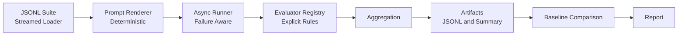

# Scalable LLM Evaluation Pipeline

<<<<<<< HEAD


A production-grade, failure-aware evaluation pipeline for Large Language Models.
Built to make prompt changes, model upgrades, and regressions visible before they ship.

This repository contains a small, production-oriented evaluation framework for testing and comparing language model behavior over time.
=======
A CLI-first tool for tracking how language model behavior changes over time.
>>>>>>> becdc72 (docs: clarify test coverage focus)

I kept running into the same problem: after tweaking a prompt or switching models, I couldn’t tell if things actually got better or just different. This repository is my attempt to stop guessing and make those changes visible.

---

## What It Does

You give it:
- A JSONL file with test cases
- A prompt template

It gives you back:
- Pass/fail results for each test
- Cost and latency estimates
- An optional comparison against a previous run
- All artifacts written to disk for later inspection

The goal is to catch regressions before they hit production.

---

<<<<<<< HEAD
## Example Output
Below is an example evaluation run rendered from persisted artifacts
(`results.jsonl`, `evaluations.jsonl`, `summary.json`).


---

## Running an Evaluation
Basic run:

```bash
python src/evalpipe/cli.py data/suites/basic_v1.jsonl \
  --prompt src/evalpipe/prompts/basic_v1.txt
```

Run with baseline comparison:

```bash
python src/evalpipe/cli.py data/suites/basic_v1.jsonl \
  --prompt src/evalpipe/prompts/basic_v1.txt \
  --baseline runs/<BASELINE_RUN_ID>
```

---

## Scalability Characteristics
- Async inference execution with bounded concurrency
- Streaming JSONL loading (no dataset fully loaded into memory)
- Failure-isolated execution (one bad row does not kill a run)
- Deterministic result ordering for reproducibility

---

## Repository Structure
```text
src/evalpipe/
├── aggregate.py
├── cli.py
├── compare.py
├── costs.py
├── pricing.py
├── evaluators/
│ ├── exact.py
│ ├── regex.py
│ ├── contains.py
│ ├── numeric.py
│ ├── schema.py
│ └── judge.py
├── loader.py
├── prompts/
├── report.py
├── runner.py
├── storage.py
└── cache/
```
All run outputs are written under `runs/` using timestamped directories.

---

## Artifacts Produced Per Run
Each run generates:
- test_cases.jsonl
- results.jsonl
- evaluations.jsonl
- summary.json
- meta.json
- report.md
=======
## Quick Start

```bash
git clone https://github.com/Joshitha-Uppalapati/scalable-llm-eval-pipeline.git
cd scalable-llm-eval-pipeline
pip install -e .

Run a basic evaluation
python src/evalpipe/cli.py run data/suites/basic_v1.jsonl \
  --prompt src/evalpipe/prompts/basic_v1.txt

Inspect results
cat runs/*/summary.json
 ```
The first run can be used as a baseline. Future runs can compare against it by passing `--baseline`.

---

## How It Works
JSONL test suite
  → prompt rendering
    → model inference
      → evaluation
        → aggregation
          → files on disk
Each test case defines:
- Input data
- Expected output or evaluation rule
- A category for grouping results
>>>>>>> becdc72 (docs: clarify test coverage focus)

The runner:
- Streams test cases (does not load everything into memory)
- Executes inference with rate limiting
- Evaluates outputs deterministically
- Writes results as JSONL
If a baseline run is provided, pass rates and regressions are compared automatically.

---

## Project Structure
src/evalpipe/
├── cli.py             
├── runner.py           
├── loader.py           
├── evaluators/     
├── aggregate.py 
├── compare.py 
├── report.py        
└── storage.py

data/suites/ 
examples/
tests/

The `examples/exploratory/` folder contains early prototypes kept for reference.

---

## Evaluation Types
Each test case explicitly selects its evaluator:
exact – exact string match
regex – pattern match
contains – substring check
numeric – numeric tolerance
schema – JSON schema validation
judge – optional LLM-as-a-judge (slower, subjective)

Example test case:
```code
{
  "id": "greeting_formal",
  "category": "tone",
  "input": { "user_name": "Dr. Smith" },
  "evaluator": "contains",
  "expected": "Dear Dr. Smith"
}
```
There is no implicit scoring. All evaluation logic is explicit.

---

## Baseline Comparison
You can compare a run against a previous one:
```bash
python src/evalpipe/cli.py run data/suites/basic_v1.jsonl \
  --prompt src/evalpipe/prompts/basic_v2.txt \
  --baseline runs/20260115_143022
```
The generated report highlights:
- Pass → fail regressions
- Fail → pass improvements
- Cost and latency deltas
- Category-level changes

If regressions are detected, the CLI exits with a non-zero status for CI gating.

---

<<<<<<< HEAD
## Design Principles
- No external services
- No hidden state
- JSONL for transparency
- Deterministic prompt rendering
- Exit codes suitable for CI gating

The goal is not novelty. The goal is predictable, reviewable behavior over time.

---

## CI Integration
The repository includes a GitHub Actions workflow that runs a smoke evaluation on every push.
Failures surface immediately via CI status and non-zero exit codes, making the pipeline safe to gate merges.
=======
## Output Files
Each run creates a timestamped directory under runs/:
```pgsql
runs/20260131_033533/
├── test_cases.jsonl
├── results.jsonl
├── evaluations.jsonl
├── summary.json
├── meta.json
└── report.md
```
These files are sufficient to audit or review a run without re-running inference.
>>>>>>> becdc72 (docs: clarify test coverage focus)

---

## CI Integration
A GitHub Actions workflow runs a smoke evaluation on each push.
If pass rate drops or regressions are detected, the workflow fails.


<<<<<<< HEAD
## Execution Flow


---

## Notes
This project intentionally avoids dashboards, databases, and orchestration layers.

---
=======
>>>>>>> becdc72 (docs: clarify test coverage focus)

## Known Limitations
Things that are not solved yet:
- Caching is local only (no distributed support)
- Cost estimation assumes OpenAI-style pricing
- No retry or backoff logic on API failures
- Judge-based evaluations can be slow and inconsistent
- Some error messages could be clearer
These are tradeoffs, not oversights.

---

## Testing
```bash
# Run tests
python -m pytest

# Run with coverage
python -m pytest --cov=src --cov-report=term
```
- Current test coverage is ~50% and focuses on evaluators and core execution paths.
- CLI and reporting paths are intentionally lightly tested.

---

## Why I Built This
I was iterating on prompts for a chatbot and realized I had no reliable way to tell whether changes were improvements or just different failures.
Existing tools either felt too heavy (databases, dashboards, services) or too shallow (single accuracy numbers, no regression tracking).
This is what I wanted instead: simple, inspectable, and easy to run in CI.